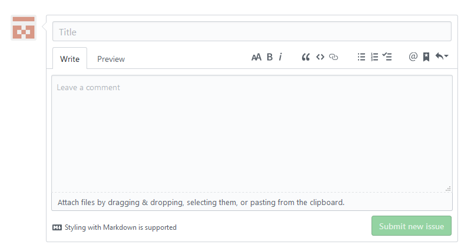

# 教程：利用GitHub进行小组开发

## 开始之前

为了更加真实的模拟真实协作，这里我使用了两个账号，下面给出这两个账号的名字以及职责

* **alphaCentauriBF   项目的发起者，管理者**
* **RAINLFF                 参与者**

在开始之前，我使用alphaCentauriBF创建了一个仓库，名为TestProj。创建的具体细节不再给出，上文已经提及。

## issue和Pull Request

使用github我们可以方便地与其他人进行协作开发，当发现项目中有不够完善的地方的时候，可以在issue中提出，在我们新建的项目中，我们用第二个账号也就是参与者来提出一个issue:完善README文件。

此时参与者的issue已经提交完毕，切换为管理员账号，此时可以看到被提交的issue。

在上面，我们已经将Assignee设置为RAINLFF，所以我们切换RAINLFF账号完成这个工作，就像我们在向导做的那样，先fork\(复制一份副本到自己的仓库\)，然后来到自己的仓库，找到fork的项目，然后创建出一个新的分支，然后再修改，然后再提交Pull Request。

接下来将账号切换到管理员账号，可以在Pull Request中看到RAINLFF账号提交的修改。选择通过，此时主干分支就发生了改变。

在进入下一步前，我们先捋一下。首先提出issue，管理员将这个issue分配\(被分配的人会收到邮件提醒\)并打上标签，然后fork\(管理员或其他人均可\)后来到自己fork的仓库中新建一个分支，修改后发起Pull Request，管理员将其合并，工作完成。在Pull Request中，管理员可以对其做出评论，发起Pull Request会收到邮件提醒。

需要注意的一点时，**当管理员创建的仓库发生改变时，你fork到的仓库不会自己发生变化，所以需要在自己这边发起Pull Request，更新自己的文件。**

与上面不同的是，这是将自己fork来的版本更新到与管理员相同的版本，所以应该在最上面的base repository中，将左边改为自己本地的项目，右边改为管理员的版本\(默认情况下，这两个是自己在右边，管理员在左边，因为是将自己的修改提交给管理员。\)，这样，就是将合并管理员那边的修改到自己的仓库，也就完成了更新代码。接下来的操作与上文相同，就不再赘述了，更新后会发现文件发生了改变。

### **补充**

这里存在一个问题，我们需要修改README文件，当我们fork下来并开了一个新的分支并执行更改的时候，master也发生了新的改变\(比如管理员自己修改或者merge了别的分支\),此时该怎么办呢？

上面提示不能自动进行merge操作\(因为远程文件也进行了修改\)，但他提示仍然可以提交Pull Request

这就需要我们进行手动merge了，下面给出一种解决方法\(方法并不唯一\)。

首先提交Pull Request

然后在Pull Request中可以找到解决冲突的按钮

&lt;&lt;&lt;到===之间是自己的内容===到&gt;&gt;&gt;之间表示了远程的master的同一行也发生了修改，这就是冲突的地方。我们可以选择解决的方式，比如将自己的放在远程的后面。

修改完成后点击mark as resolved提示冲突解决，就可以进一步执行commit merge了。

## projects

很多朋友可能也注意到了project这个选项，这个选项有什么用呢？这是项目管理，可以在其中添加一些功能，比如代办事项表，或者发布一些任务等。

